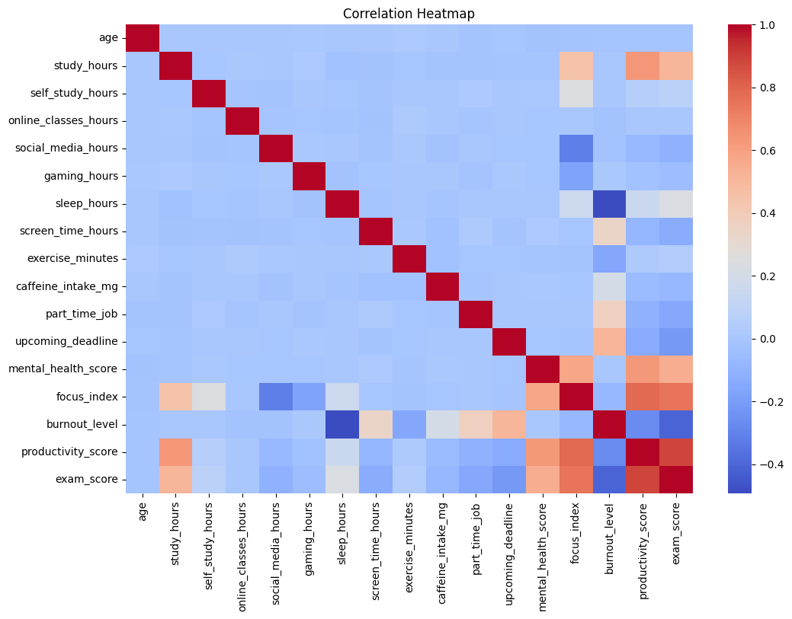
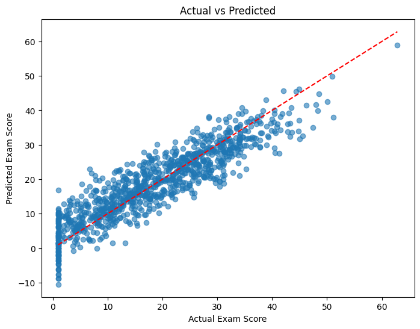
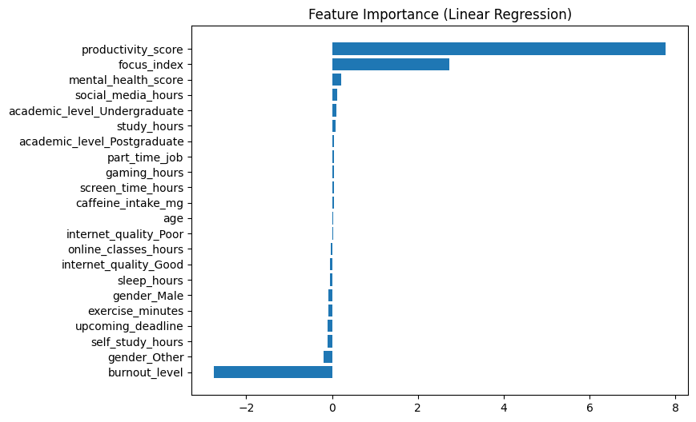

# 📈 Linear Regression: Student Performance Prediction

Welcome to the **Student Performance Prediction Project! 🚀**  
This project analyzes student behavior and predicts **exam scores** using **Linear Regression**.

---

# 📊 Exploratory Data Analysis (EDA)

## 1️⃣ Gaming Hours vs Study Hours

👉 Insight:
- Negative relationship observed  
- Students who spend more time gaming tend to study less  
- Indicates poor time management affects study habits  

---

## 2️⃣ Study Hours vs Exam Score

👉 Insight:
- Strong positive correlation  
- More study hours → higher exam scores  
- One of the most important predictors  

---

## 3️⃣ Distribution of Exam Scores

👉 Insight:
- Data follows approximately normal distribution  
- Most students score around average  
- Few extreme high/low performers  

---

## 4️⃣ Correlation Heatmap

👉 Insight:
- study_hours → strong positive correlation with exam_score  
- gaming_hours → negative correlation  
- Confirms behavioral impact on performance  

---

## 5️⃣ Model Performance: Actual vs Predicted

👉 Insight:
- Points closely follow diagonal line  
- Indicates good model accuracy  
- Predictions are close to actual values  

---

## 6️⃣ Feature Importance

👉 Insight:

productivity_score and focus_index show strong influence
study_hours → positive impact
gaming_hours → negative impact

👉 Note:

Some features like productivity_score have higher coefficients because they are more directly related to exam performance, while study_hours influences performance indirectly.

---

# 🤖 Model Performance

### Evaluation Metrics:

- **R² Score:** ~0.7 – 0.9  
👉 Model explains most of the variance  

- **MAE (Mean Absolute Error):** ~3–6 marks  
👉 On average, prediction is off by 3–6 marks  

- **RMSE:** ~4–7 marks  
👉 Shows overall prediction error  

---

# 🔢 Interpreting the Model

👉 Holding other factors constant:

Increase in study_hours → increases exam score
Increase in gaming_hours → decreases exam score

👉 Interpretation:

Study habits improve performance
Gaming negatively impacts academic results
Productivity and focus act as strong direct predictors

---

# 📌 Key Insights

✅ Study hours positively impact performance
✅ Gaming hours negatively affect performance
✅ Productivity and focus are strong predictors
✅ Model provides accurate predictions
✅ Student behavior plays a major role in results

---

# 💡 Recommendations

- Encourage students to increase study time  
- Limit excessive gaming  
- Focus on productive habits  
- Use data-driven strategies for academic improvement  

---

# 🚀 Conclusion

This project demonstrates how **Linear Regression** can be used to:
- Analyze student behavior  
- Identify key performance factors  
- Predict exam outcomes effectively  

---
